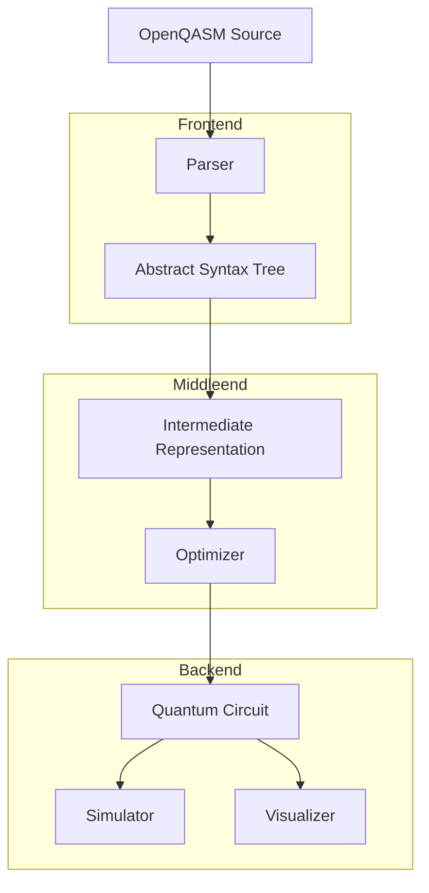

# OpenQASM Compiler

A modern C++ compiler for OpenQASM (Quantum Assembly Language) with support for quantum circuit optimization and simulation.

## Introduction

The OpenQASM Compiler is a powerful tool for compiling and optimizing quantum circuits written in OpenQASM 2.0. It provides a complete toolchain from parsing OpenQASM code to generating optimized quantum circuits, with support for simulation and visualization.

Key features include:
- Full OpenQASM 2.0 language support
- Quantum circuit optimization
- Circuit simulation capabilities
- Cross-platform compatibility
- Comprehensive testing and documentation
- Modern C++ implementation

## Building

### Prerequisites

- CMake 3.10 or higher
- C++17 compatible compiler
- Eigen3
- CLI11
- (Optional) Doxygen and Graphviz for documentation
- (Optional) clang-tidy for static analysis
- (Optional) lcov for coverage reporting

### Build Options

The project supports several build options that can be enabled during configuration:

```bash
# Enable code coverage reporting
cmake -DENABLE_COVERAGE=ON ..

# Enable clang-tidy static analysis
cmake -DENABLE_CLANG_TIDY=ON ..

# Enable Doxygen documentation generation
cmake -DENABLE_DOXYGEN=ON ..

# Build documentation
cmake --build . --target docs
```

### Build Steps

```bash
# Clone the repository
git clone https://github.com/doomhammerhell/OpenQASMCompiler.git
cd OpenQASMCompiler

# Create build directory
mkdir build
cd build

# Configure with CMake
cmake ..

# Build the project
cmake --build .

# Run tests
ctest
```

## Usage

### Basic Usage

```bash
# Compile an OpenQASM file
./qasmc input.qasm -o output.qasm

# Enable optimization
./qasmc input.qasm -o output.qasm --optimize

# Generate visualization
./qasmc input.qasm -o output.qasm --visualize
```

### Example OpenQASM Code

Here's a simple example of an OpenQASM program that creates a Bell state:

```qasm
OPENQASM 2.0;
include "qelib1.inc";

qreg q[2];
creg c[2];

h q[0];
cx q[0], q[1];

measure q[0] -> c[0];
measure q[1] -> c[1];
```

### Expected Output

When compiled and simulated, the above program should produce:

```
Circuit Statistics:
- Number of qubits: 2
- Number of gates: 3
- Circuit depth: 2

Measurement Results (1000 shots):
|00⟩: 502 (50.2%)
|01⟩: 0 (0.0%)
|10⟩: 0 (0.0%)
|11⟩: 498 (49.8%)
```

## Project Architecture



### Components

1. **Frontend**
   - Parser: Converts OpenQASM text to AST
   - AST: Represents the program structure

2. **Middleend**
   - IR: Intermediate representation for optimization
   - Optimizer: Applies circuit optimizations

3. **Backend**
   - Quantum Circuit: Final optimized circuit
   - Simulator: Executes the circuit
   - Visualizer: Generates circuit diagrams

## Development

### Code Quality

The project uses several tools to ensure code quality:

- **clang-tidy**: Static code analysis
- **Valgrind**: Memory checking (Linux only)
- **Code Coverage**: LCOV for coverage reporting
- **Doxygen**: API documentation generation

### Continuous Integration

The project uses GitHub Actions for continuous integration, which:

- Builds and tests on multiple platforms (Linux, Windows, macOS)
- Runs static analysis
- Generates code coverage reports
- Builds documentation
- Uploads artifacts

## License

This project is licensed under the MIT License - see the LICENSE file for details.

## Contributing

Contributions are welcome! Please feel free to submit a Pull Request. For major changes, please open an issue first to discuss what you would like to change.
